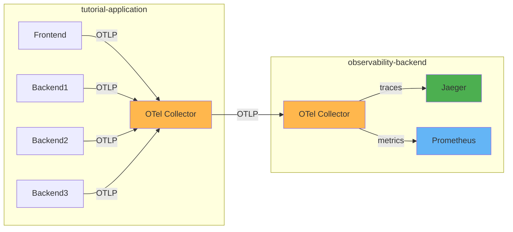

# Full-Stack Observability on a Budget: A Guide to Strategic Sampling and Data Optimization

Welcome to the Observability on a Budget tutorial!

Today we will focus on understanding and reducing the observability cost. The tutorial will cover theory behind head and tail based sampling and
practical application by using OpenTelemetry instrumentation and mostly collector.
We will be deploying everything on Kubernetes and use Prometheus and Jaeger as backends.

## Setup

### Kubectl

Almost all the following steps in this tutorial require kubectl. Your used version should not differ more than +-1 from the used cluster version. Please follow [this](https://kubernetes.io/docs/tasks/tools/install-kubectl-linux/#install-kubectl-binary-with-curl-on-linux) installation guide.

### Kind

[Kind Quickstart](https://kind.sigs.k8s.io/docs/user/quick-start/).

If [go](https://go.dev/) is installed on your machine, `kind` can be easily installed as follows:

```bash
go install sigs.k8s.io/kind@v0.31.0
```

If this is not the case, simply download the [kind-v0.31.0](https://github.com/kubernetes-sigs/kind/releases/tag/v0.31.0) binary from the release page. (Other versions will probably work too. :cowboy_hat_face:)

### Create a workshop cluster

After a successful installation, a cluster can be created as follows:

```bash
kind create cluster --name=workshop --config=kind-1.35.yaml
```

Kind automatically sets the kube context to the created workshop cluster. We can easily check this by getting information about our nodes.

```bash
kubectl get nodes
```
Expected is the following:

```bash
NAME                     STATUS   ROLES           AGE   VERSION
workshop-control-plane   Ready    control-plane   6s   v1.35.0
```

### Cleanup
```bash
kind delete cluster --name=workshop
```

## Deploy initial services

### Deploy cert-manager

[cert-manager](https://cert-manager.io/docs/) is used by OpenTelemetry operator to provision TLS certificates for admission webhooks.

```bash
kubectl apply -f https://github.com/cert-manager/cert-manager/releases/download/v1.19.4/cert-manager.yaml
kubectl get pods -n cert-manager -w
```

### Deploy OpenTelemetry operator

```bash
kubectl apply -f https://github.com/open-telemetry/opentelemetry-operator/releases/download/v0.146.0/opentelemetry-operator.yaml
kubectl get pods -n opentelemetry-operator-system -w
```

### Deploy observability backend

This course is all about Observabilty, so a backend is needed. If you don't have one, you can install Prometheus for metrics and Jaeger for traces as follows:

```bash
kubectl apply -f https://raw.githubusercontent.com/pavolloffay/kubecon-eu-2026-opentelemetry-observability-on-budget/main/backend/01-backend.yaml
kubectl get pods -n observability-backend -w
```



Afterwards, the backend can be found in the namespace `observability-backend`.

```bash
kubectl port-forward -n observability-backend service/jaeger-query 16686:16686
```

Open Jaeger in the browser [localhost:16686](http://localhost:16686/)

```bash
kubectl port-forward -n observability-backend service/prometheus 9090:80
```

Open Prometheus in the browser [localhost:9090](http://localhost:9090/)

## Clone the repository

Clone the repository to your local machine. We will be modifying the demo application.

```bash
git clone git@github.com:pavolloffay/kubecon-eu-2026-opentelemetry-observability-on-budget.git
```

Run the build to cache docker images:

```bash
make docker-build
```

---

[Next steps](./02-sampling-overview.md)
