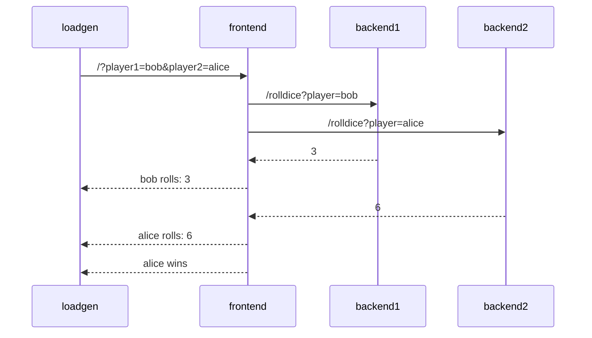

# Demo Application

## Application Description

The sample application is a simple _"dice game"_, where two players roll a
dice, and the player with the highest number wins.

There are 3 microservices within this application:

- Service `frontend` in Node.JS, that has an API endpoint `/` which takes two
  player names as query parameters (player1 and player2). The service calls 2
  down stream services (backend1, backend2), which each returning a random number
  between 1-6. The winner is computed and returned.
- Service `backend1` in python, that has an API endpoint `/rolldice` which takes
  a player name as query parameter. The service returns a random number between
  1 and 6.
- Service `backend2` in Java, that also has an API endpoint `/rolldice` which
  takes a player name as query parameter. The service returns a random number
  between 1 and 6.

Additionally there is a `loadgen` service, which utilizes `curl` to periodically
call the frontend service.

Let's assume player `alice` and `bob` use our service, here's a potential
sequence diagram:



### Deploy the app into Kubernetes

Deploy the application into the kubernetes cluster. The app will be deployed into `tutorial-application` namespace.

```bash
kubectl apply -f https://raw.githubusercontent.com/pavolloffay/kubecon-eu-2026-opentelemetry-observability-on-budget/main/app/k8s.yaml
```
```bash
kubectl get pods -n tutorial-application -w
...
NAME                                   READY   STATUS    RESTARTS   AGE
backend1-deployment-577cf945b4-tz5kv   1/1     Running   0          62s
backend2-deployment-59d4b47774-xbq84   1/1     Running   0          62s
frontend-deployment-678795956d-zwg4q   1/1     Running   0          62s
loadgen-deployment-5c7d6896f8-2fz6h    1/1     Running   0          62s
```

Now port-forward the frontend app:

```bash
kubectl port-forward service/frontend-service -n tutorial-application 4000:4000 
```

Open browser at [http://localhost:4000/](http://localhost:4000/).