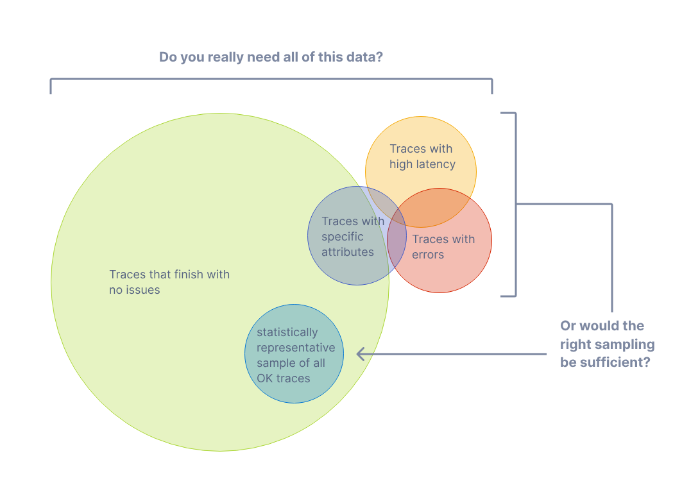
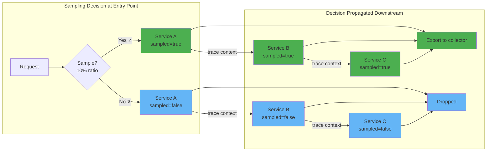
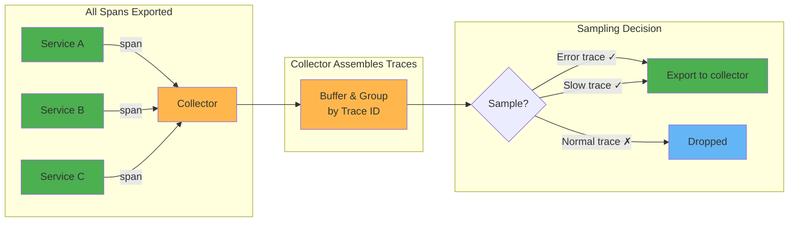

# Sampling overview

The goal with sampling is to reduce data volume and costs while maintaining observability - either by keeping a representative sample (head-based) or by prioritizing interesting traces (tail-based).



Source: [OpenTelemetry Sampling](https://opentelemetry.io/docs/concepts/sampling/)

Why sampling?:
* Cost Management: Storing and processing 100% of traces is rarely cost-effective.
* Resource Reduction: Generating and sending all temenetry data consumer CPU, memory and network resources.
* Noise Filtering: Most requests are "healthy" and repetitive; you often only need a representative slice to identify patterns.

## Head based sampling

The sampling decision is made at the start of the trace (the "head") and propagated to all downstream services via trace context.



**Pros:**
- Simple to implement
- Low resource overhead

**Cons:**
- Cannot make decisions based on trace outcome (errors, latency)
- May miss important traces that happen to not be sampled

### Head based sampling in OpenTelemetry

Head-based sampling is configured in the SDK. The main built-in options are:

| Sampler | Description |
|---------|-------------|
| [AlwaysOn](https://opentelemetry.io/docs/specs/otel/trace/sdk/#alwayson) | Samples every trace (100%) |
| [AlwaysOff](https://opentelemetry.io/docs/specs/otel/trace/sdk/#alwaysoff) | Samples no traces (0%) |
| [TraceIdRatioBased](https://opentelemetry.io/docs/specs/otel/trace/sdk/#traceidratiobased) | Samples a configurable percentage based on trace ID (deprecated) |
| [ProbabilitySampler](https://opentelemetry.io/docs/specs/otel/trace/sdk/#probabilitysampler) | Samples based on W3C Trace Context Level 2 randomness (recommended) |
| [ParentBased](https://opentelemetry.io/docs/specs/otel/trace/sdk/#parentbased) | Delegates to different samplers based on parent span's sampling decision |

#### Code: ParentBased with ProbabilitySampler

The recommended configuration wraps ProbabilitySampler with ParentBased. This ensures root spans use probability sampling while child spans respect the parent's decision.

```go
import "go.opentelemetry.io/otel/sdk/trace"

sampler := trace.ParentBased(
    trace.ProbabilitySampler(0.1), // 10% sampling for root spans
)
```

The logic:
- Root span (no parent) → ProbabilitySampler makes the decision
- Child span with sampled parent → Always sampled (follows parent)
- Child span with unsampled parent → Never sampled (follows parent)

See [OpenTelemetry SDK Sampling documentation](https://opentelemetry.io/docs/specs/otel/trace/sdk/#sampling) for more details.

#### TraceIdRatioBased vs ProbabilitySampler

| Aspect | TraceIdRatioBased | ProbabilitySampler |
|--------|-------------------|-------------------|
| Algorithm | Never fully specified | W3C Trace Context Level 2 standard |
| Cross-SDK consistency | Inconsistent between languages | Consistent |
| Threshold propagation | No | Yes, sets `th:T` in tracestate |

ProbabilitySampler follows the W3C standard, ensuring consistent sampling across all SDK implementations. It also propagates the sampling threshold in tracestate (`ot=th:...`).

##### Threshold

The `ot=th:...` in tracestate is the sampling threshold defined by the W3C Trace Context probability sampling specification.

```
threshold = (1 - probability) × 2^56
Example calculation for 10% sampling:                                                                                                                                                                                                                                                                                                       
threshold = (1 - 0.1) × 2^56
          = 0.9 × 72057594037927936                                                                                                                                                                                                                                                                                                          
          = 64851834634135142                                                                                                                                                                                                                                                                                                                
          = 0xe6666666666666 (hex) 

The trace ID (128 bits / 16 bytes) has its last 7 bytes (56 bits) used as the random value:                                                                                                                                                                                                                                                 
Trace ID:  [8 bytes timestamp/random] [7 bytes randomness]                                                                                                                                                                                                                                                                                  
                                       ↑                                                                                                                                                                                                                                                                                                    
                                 used for comparison                                   
Comparison logic:                                                                                                                                                                                                                                                                                                                           
randomness = traceId[9:16] as uint64  # last 7 bytes                                                                                                                                                                                                                                                                                        
if randomness >= threshold:
    sample = true                                                                                                                                                                                                                                                                                                                           
else:                                                                                                                                                                                                                                                                                                                                       
    sample = false   
```

##### Use-case example
- Adjusted counts - backends multiply sampled spans by 1/probability to estimate actual traffic

If you observe 500 sampled requests with 5 errors and 10% threshold:
```
Estimated actual requests = 500 × (1/0.1) = 5,000 requests
Estimated actual errors   = 5 × (1/0.1)   = 50 errors
Estimated error rate      = 50/5,000      = 1%
```

- Consistent root decisions - multiple entry point services with same threshold configuration make identical sampling decisions for the same trace ID
- Rate limiting awareness - collectors can understand the upstream sampling rate when applying additional filtering
- SLO calculations - accurate error rate and latency percentiles require knowing the sampling bias
- Billing and capacity planning - estimate actual request volumes from sampled data


## Tail based sampling

The sampling decision is made at the end of the trace (the "tail") by a collector that assembles complete trace (all spans from a trace) before deciding whether to keep or drop it.



**Pros:**
- Can make decisions based on trace outcome (errors, latency, specific attributes)
- Ensures important traces are always captured
- More intelligent sampling based on actual trace data

**Cons:**
- Higher resource overhead (memory to buffer traces)
- More complex to implement
- Requires centralized collector
- Adds latency before data reaches backend

---

[Next steps](./03-application.md)
