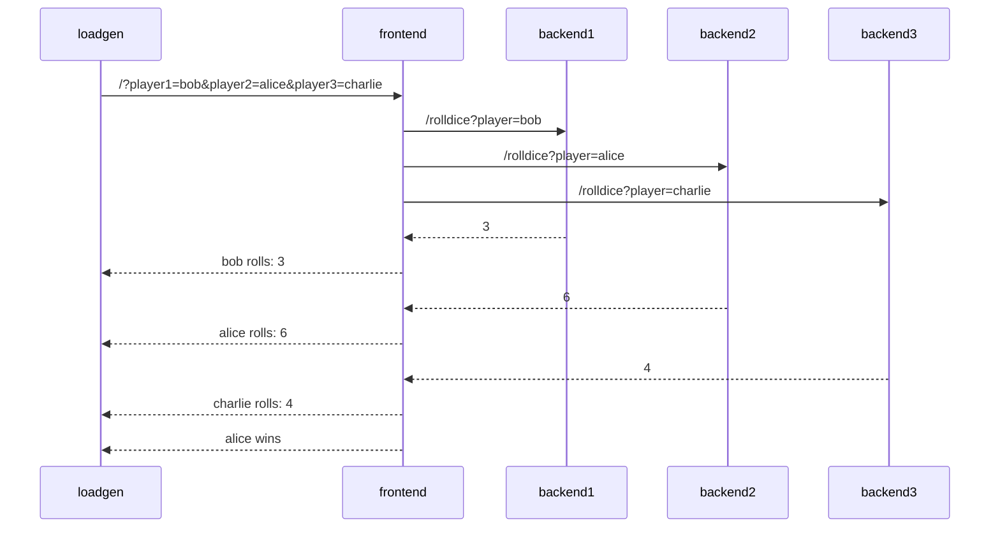

# Demo Application

## Application Description

The sample application is a simple _"dice game"_, where three players roll a
dice, and the player with the highest number wins.

There are 4 microservices within this application:

- Service `frontend` in Node.JS, that has an API endpoint `/` which takes three
  player names as query parameters (player1, player2 and player3). The service calls 3
  downstream services (backend1, backend2, backend3), which each return a random number
  between 1-6. The winner is computed and returned.
- Service `backend1` in Python, that has an API endpoint `/rolldice` which takes
  a player name as query parameter. The service returns a random number between
  1 and 6.
- Service `backend2` in Java, that also has an API endpoint `/rolldice` which
  takes a player name as query parameter. The service returns a random number
  between 1 and 6.
- Service `backend3` in Go, that also has an API endpoint `/rolldice` which
  takes a player name as query parameter. The service returns a random number
  between 1 and 6.

Additionally there is a `loadgen` service, which utilizes `curl` to periodically
call the frontend service.

Let's assume players `alice`, `bob` and `charlie` use our service, here's a potential
sequence diagram:



### Deploy the app into Kubernetes

Deploy the application into the kubernetes cluster. The app will be deployed into `tutorial-application` namespace.

Instrumentation:
```bash
kubectl apply -f https://raw.githubusercontent.com/pavolloffay/kubecon-eu-2026-opentelemetry-observability-on-budget/main/app/01-instrumentation.yaml
```

Collector:
```bash
kubectl apply -f https://raw.githubusercontent.com/pavolloffay/kubecon-eu-2026-opentelemetry-observability-on-budget/main/app/00-collector.yaml
```

Loadgen:
```bash
kubectl apply -f https://raw.githubusercontent.com/pavolloffay/kubecon-eu-2026-opentelemetry-observability-on-budget/main/app/02-app.yaml
```

App:
```bash
kubectl get pods -n tutorial-application -w
...
NAME                                   READY   STATUS    RESTARTS   AGE
backend1-deployment-577cf945b4-tz5kv   1/1     Running   0          62s
backend2-deployment-59d4b47774-xbq84   1/1     Running   0          62s
backend3-deployment-6b8f4d7c95-km3wp   1/1     Running   0          62s
frontend-deployment-678795956d-zwg4q   1/1     Running   0          62s
loadgen-deployment-5c7d6896f8-2fz6h    1/1     Running   0          62s
```

```bash
kubectl apply -f https://raw.githubusercontent.com/pavolloffay/kubecon-eu-2026-opentelemetry-observability-on-budget/main/app/loadgen.yaml
```

The frontend, backend1 and backed2 should have injected otel auto-instrumentation:
```bash
kbectl get pods -n tutorial-application  frontend-deployment-67fc9977ff-wv9bk -o yaml                                                                                                                                                        ploffay@fedora
apiVersion: v1
kind: Pod
metadata:
  annotations:
    instrumentation.opentelemetry.io/inject-nodejs: "true"
  labels:
    app: frontend
    pod-template-hash: 67fc9977ff
  name: frontend-deployment-67fc9977ff-wv9bk
  namespace: tutorial-application
spec:
  containers:
  - env:
    - name: OTEL_NODE_IP
      valueFrom:
        fieldRef:
          apiVersion: v1
          fieldPath: status.hostIP
    - name: OTEL_POD_IP
      valueFrom:
        fieldRef:
          apiVersion: v1
          fieldPath: status.podIP
    - name: OTEL_INSTRUMENTATION_ENABLED
      value: "true"
    - name: BACKEND1_URL
      value: http://backend1-service:5000/rolldice
    - name: BACKEND2_URL
      value: http://backend2-service:5165/rolldice
    - name: BACKEND3_URL
      value: http://backend3-service:5165/rolldice
    - name: NODE_OPTIONS
      value: ' --require /otel-auto-instrumentation-nodejs/autoinstrumentation.js'
    - name: OTEL_SERVICE_NAME
      value: frontend-deployment
    - name: OTEL_EXPORTER_OTLP_ENDPOINT
      value: http://otel-collector.tutorial-application.svc.cluster.local:4317
    - name: OTEL_RESOURCE_ATTRIBUTES_POD_NAME
      valueFrom:
        fieldRef:
          apiVersion: v1
          fieldPath: metadata.name
    - name: OTEL_RESOURCE_ATTRIBUTES_POD_UID
      valueFrom:
        fieldRef:
          apiVersion: v1
          fieldPath: metadata.uid
    - name: OTEL_RESOURCE_ATTRIBUTES_NODE_NAME
      valueFrom:
        fieldRef:
          apiVersion: v1
          fieldPath: spec.nodeName
    - name: OTEL_PROPAGATORS
      value: tracecontext,baggage,b3
    - name: OTEL_TRACES_SAMPLER
      value: parentbased_traceidratio
    - name: OTEL_TRACES_SAMPLER_ARG
      value: "1"
    - name: OTEL_RESOURCE_ATTRIBUTES
      value: k8s.container.name=frontend,k8s.deployment.name=frontend-deployment,k8s.deployment.uid=61963d9f-0902-408c-ab17-070760e0df13,k8s.namespace.name=tutorial-application,k8s.node.name=$(OTEL_RESOURCE_ATTRIBUTES_NODE_NAME),k8s.pod.name=$(OTEL_RESOURCE_ATTRIBUTES_POD_NAME),k8s.pod.uid=$(OTEL_RESOURCE_ATTRIBUTES_POD_UID),k8s.replicaset.name=frontend-deployment-67fc9977ff,k8s.replicaset.uid=54e7e65e-4f36-46b5-a7bf-cd9a18b24054,service.instance.id=tutorial-application.$(OTEL_RESOURCE_ATTRIBUTES_POD_NAME).frontend,service.namespace=tutorial-application,service.version=latest
    name: frontend
    ports:
    - containerPort: 4000
      protocol: TCP
    volumeMounts:
    - mountPath: /otel-auto-instrumentation-nodejs
      name: opentelemetry-auto-instrumentation-nodejs
  initContainers:
  - command:
    - cp
    - -r
    - /autoinstrumentation/.
    - /otel-auto-instrumentation-nodejs
    image: ghcr.io/open-telemetry/opentelemetry-operator/autoinstrumentation-nodejs:0.71.0
    imagePullPolicy: IfNotPresent
    name: opentelemetry-auto-instrumentation-nodejs
    terminationMessagePath: /dev/termination-log
    terminationMessagePolicy: File
    volumeMounts:
    - mountPath: /otel-auto-instrumentation-nodejs
      name: opentelemetry-auto-instrumentation-nodejs
```

Now port-forward the frontend app:

```bash
kubectl port-forward service/frontend-service -n tutorial-application 4000:4000 
```

Open browser at [http://localhost:4000/](http://localhost:4000/).


## Build

The app can be built:

```bash
make docker-build
# Load images to Kind cluster
make kind-load 
# Restart workloads
make restart
```