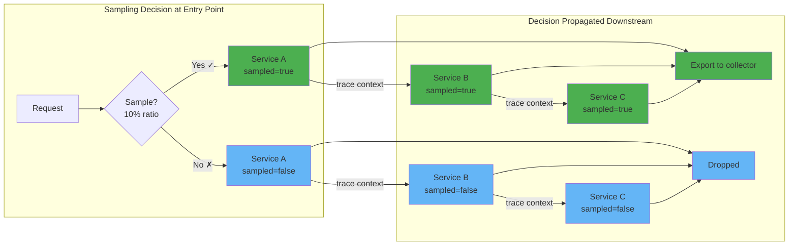

# Head based sampling

The sampling decision is made at the start of the trace (the "head") and propagated to all downstream services via trace context. The first service in the request chain decides whether to sample, and all downstream services honor that decision.

## How it works

1. A request arrives at the entry point service
2. The sampler makes a decision (e.g., 10% probability)
3. The decision is encoded in the `traceparent` header (`sampled` flag)
4. All downstream services read the flag and follow the decision
5. Sampled spans are exported; unsampled spans are dropped



## Jaeger remote sampling

Jaeger remote sampling allows SDKs to dynamically fetch sampling strategies from the OpenTelemetry Collector, enabling centralized per-service sampling configuration without redeploying applications.

### How it works

1. The collector serves sampling strategies via the [`jaegerremotesampling`](https://github.com/open-telemetry/opentelemetry-collector-contrib/tree/main/extension/jaegerremotesampling) extension
2. SDKs periodically poll the collector for their sampling configuration
3. When the configuration changes, SDKs pick up new rates without restart

### Collector configuration

```yaml
extensions:
  jaegerremotesampling:
    source:
      file: ./sampling-strategies.json

service:
  extensions: [jaegerremotesampling]
```

### Sampling strategies file

```json
{
  "default_strategy": {
    "type": "probabilistic",
    "param": 0.1
  },
  "service_strategies": [
    {
      "service": "payment-service",
      "type": "probabilistic",
      "param": 0.5
    },
    {
      "service": "health-check",
      "type": "probabilistic",
      "param": 0.01
    }
  ]
}
```

### Benefits

- **Centralized control** - manage sampling rates for all services from one place
- **Per-service rates** - critical services get higher sampling, noisy services get lower
- **Dynamic updates** - change rates without redeploying applications
- **SDK-level sampling** - decisions are made before spans are created, saving application resources and network bandwidth

## Head sampling in the SDK

## Head sampling in the collector
