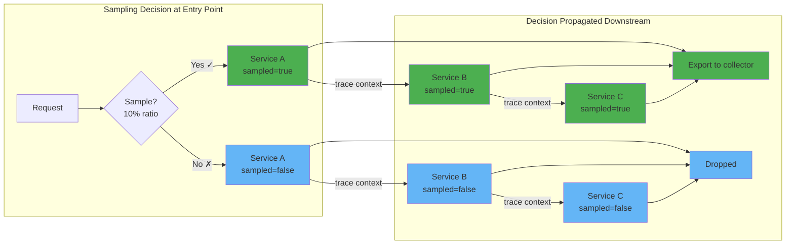

= Head based sampling

The sampling decision is made at the start of the trace (the "head") and propagated to all downstream services via trace context. The first service in the request chain decides whether to sample, and all downstream services honor that decision.

== How it works

1. A request arrives at the entry point service
2. The sampler makes a decision (e.g., 10% probability)
3. The decision is encoded in the `traceparent` header (`sampled` flag)
4. All downstream services read the flag and follow the decision
5. Sampled spans are exported; unsampled spans are dropped

## Head sampling in the SDK

## Head sampling in the collector
