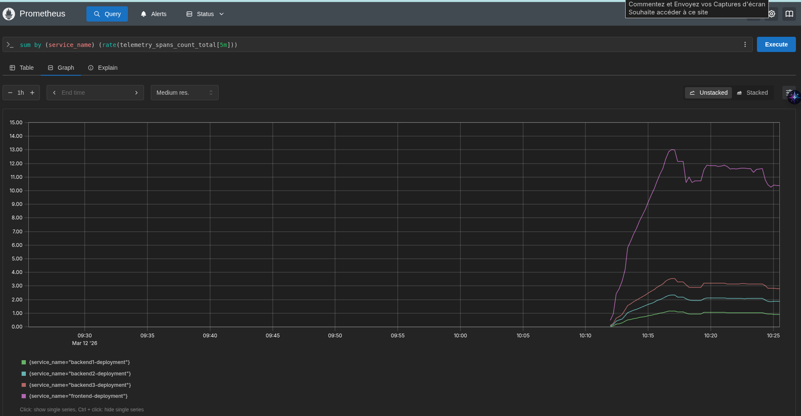
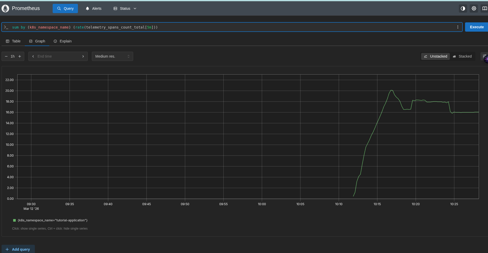
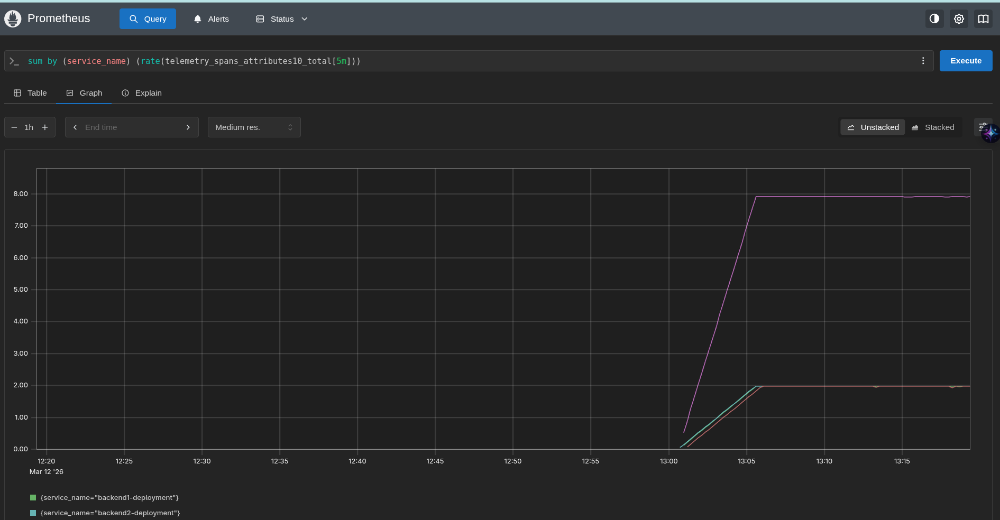
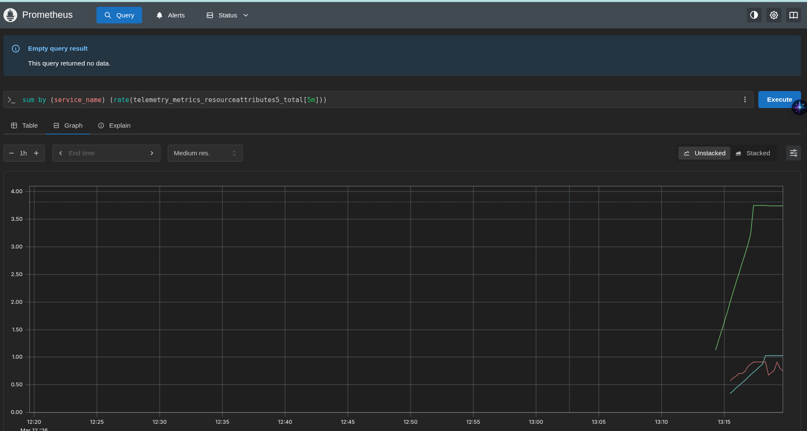
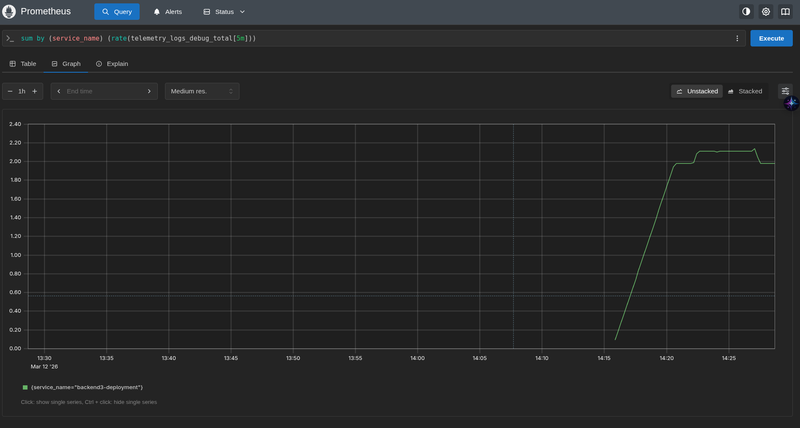
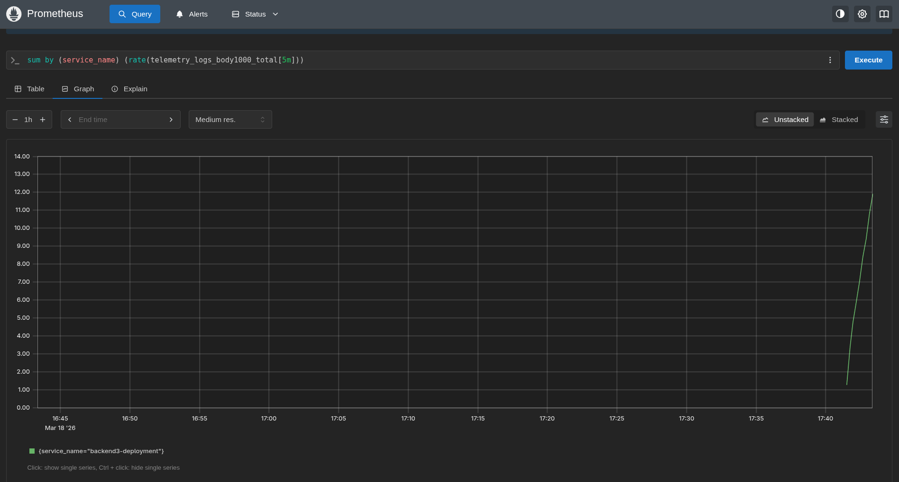

# Telemetry Data Profiling

Telemetry data profiling allows you to understand how much telemetry is flowing through the system and what workloads are sending the most telemetry.

## Collector internal metrics

The OpenTelemetry Collector exposes internal metrics that help understand how much telemetry data is flowing through the system.

- [All signals per second (traces, metrics, logs)](http://localhost:9090/query?g0.expr=label_replace%28sum%28rate%28otelcol_receiver_accepted_spans_total%5B5m%5D%29%29%2C+%22signal%22%2C+%22traces%22%2C+%22%22%2C+%22%22%29%0Aor%0Alabel_replace%28sum%28rate%28otelcol_receiver_accepted_metric_points_total%5B5m%5D%29%29%2C+%22signal%22%2C+%22metrics%22%2C+%22%22%2C+%22%22%29%0Aor%0Alabel_replace%28sum%28rate%28otelcol_receiver_accepted_log_records_total%5B5m%5D%29%29%2C+%22signal%22%2C+%22logs%22%2C+%22%22%2C+%22%22%29&g0.show_tree=0&g0.tab=graph&g0.range_input=1h&g0.res_type=auto&g0.res_density=medium&g0.display_mode=lines&g0.show_exemplars=0&g1.expr=label_replace%28sum%28rate%28otelcol_receiver_refused_spans_total%5B5m%5D%29%29%2C+%22signal%22%2C+%22traces%22%2C+%22%22%2C+%22%22%29%0Aor%0Alabel_replace%28sum%28rate%28otelcol_receiver_refused_metric_points_total%5B5m%5D%29%29%2C+%22signal%22%2C+%22metrics%22%2C+%22%22%2C+%22%22%29%0Aor%0Alabel_replace%28sum%28rate%28otelcol_receiver_refused_log_records_total%5B5m%5D%29%29%2C+%22signal%22%2C+%22logs%22%2C+%22%22%2C+%22%22%29&g1.show_tree=0&g1.tab=graph&g1.range_input=1h&g1.res_type=auto&g1.res_density=medium&g1.display_mode=lines&g1.show_exemplars=0)
- [Spans accepted and refused per second](http://localhost:9090/graph?g0.expr=rate(otelcol_receiver_accepted_spans_total[5m])&g0.tab=0&g0.range_input=1h&g1.expr=rate(otelcol_receiver_refused_spans_total[5m])&g1.tab=0&g1.range_input=1h)
- [Metric data points accepted and refused per second](http://localhost:9090/graph?g0.expr=rate(otelcol_receiver_accepted_metric_points_total[5m])&g0.tab=0&g0.range_input=1h&g1.expr=rate(otelcol_receiver_refused_metric_points_total[5m])&g1.tab=0&g1.range_input=1h)
- [Log records accepted and refused per second](http://localhost:9090/graph?g0.expr=rate(otelcol_receiver_accepted_log_records_total[5m])&g0.tab=0&g0.range_input=1h&g1.expr=rate(otelcol_receiver_refused_log_records_total[5m])&g1.tab=0&g1.range_input=1h)
- [Queue size and capacity](http://localhost:9090/graph?g0.expr=otelcol_exporter_queue_size&g0.tab=0&g0.range_input=1h&g1.expr=otelcol_exporter_queue_capacity&g1.tab=0&g1.range_input=1h)


```yaml
    service:
      telemetry:
        metrics:
          readers:
            - periodic:
                exporter:
                  otlp:
                    protocol: grpc
                    endpoint: otel-collector.observability-backend.svc.cluster.local:4317
                    insecure: true
```

Full configuration is in [app/00-collector.yaml](./app/00-collector.yaml)

## Profile telemetry

The collector internal metrics above show overall throughput, but don't tell you **which workload** is responsible. To break down telemetry by service or namespace, use the **Count Connector** in the collector.

The Count Connector counts spans, metric data points, and log records passing through the pipeline and produces new metrics grouped by resource attributes like `service.name` or `k8s.namespace.name`.

### Count traces, logs and metrics by service

Add the following to the collector configuration:

```bash
kubectl apply -f https://raw.githubusercontent.com/pavolloffay/kubecon-eu-2026-opentelemetry-observability-on-budget/refs/heads/main/app/03-collector-data-profiling.yaml
```

```yaml
connectors:
  count:
    spans:
      telemetry.spans.count:
        description: "Span count per service"
        attributes:
          - key: service.name
          - key: k8s.namespace.name
    logs:
      telemetry.logs.count:
        description: "Log count per service"
        attributes:
          - key: service.name
          - key: k8s.namespace.name
    datapoints:
      telemetry.metrics.count:
        description: "Metric data point count per service"
        attributes:
          - key: service.name
          - key: k8s.namespace.name

service:
  pipelines:
    traces:
      receivers: [otlp]
      exporters: [otlp_grpc, count]   # add count connector as exporter
    logs:
      receivers: [otlp]
      exporters: [otlp_grpc, count]
    metrics:
      receivers: [otlp]
      exporters: [otlp_grpc, count]
    metrics/count:                      # new pipeline for count connector output
      receivers: [count]                # count connector as receiver
      exporters: [otlp_grpc]
```

The count connector acts as both an **exporter** (receives data from the traces/logs/metrics pipelines) and a **receiver** (produces new metrics into the metrics/count pipeline).




- [Span, metrics and logs per second by service](http://localhost:9090/query?g0.expr=sum+by+%28service_name%29+%28rate%28telemetry_spans_count_total%5B5m%5D%29%29&g0.show_tree=0&g0.tab=graph&g0.range_input=1h&g0.res_type=auto&g0.res_density=medium&g0.display_mode=lines&g0.show_exemplars=0&g1.expr=sum+by+%28service_name%29+%28rate%28telemetry_metrics_count_total%5B5m%5D%29%29&g1.show_tree=0&g1.tab=graph&g1.range_input=1h&g1.res_type=auto&g1.res_density=medium&g1.display_mode=lines&g1.show_exemplars=0&g2.expr=sum+by+%28service_name%29+%28rate%28telemetry_logs_count_total%5B5m%5D%29%29+&g2.show_tree=0&g2.tab=graph&g2.range_input=1h&g2.res_type=auto&g2.res_density=medium&g2.display_mode=lines&g2.show_exemplars=0)
- [Telemetry volume by namespace](http://localhost:9090/graph?g0.expr=sum%20by%20(k8s_namespace_name)%20(rate(telemetry_spans_count_total[5m]))&g0.tab=0&g0.range_input=1h)

#### What to look for

- Noisy services - one service producing disproportionately more spans/logs than others
- Unexpected namespaces - telemetry from namespaces you didn't expect
- Signal imbalance - a service producing many logs but few traces (or vice versa) may indicate misconfiguration
- Growth over time - compare volumes over hours/days to detect trends

#### High cardinality metrics

The count connector can help to identify potential cardinality issues, but cannot directly measure cardinality (unique label combinations).

- [Top 10 highest cardinality + Time series count per metric](http://localhost:9090/query?g0.expr=topk%2810%2C+count+by+%28__name__%29+%28%7B__name__%3D~%22.%2B%22%7D%29%29&g0.show_tree=0&g0.tab=table&g0.range_input=1h&g1.expr=count+by+%28__name__%29+%28%7B__name__%3D~%22.%2B%22%7D%29&g1.show_tree=0&g1.tab=table&g1.range_input=1h)

### Count "malicious" telemetry data

The count connector supports **conditions** using OTTL expressions. This lets you count spans/logs that exceed size thresholds and flag noisy workloads.

Add the following to the count connector configuration:

```yaml
connectors:
  count:
    spans:
      telemetry.spans.attributes10:
        description: "Spans with more than 10 attributes"
        conditions:
          - Len(attributes) > 10
        attributes:
          - key: service.name
          - key: k8s.namespace.name
      telemetry.spans.dropped_attributes:
        description: "Spans with dropped attributes"
        conditions:
          - dropped_attributes_count > 0
        attributes:
          - key: service.name
          - key: k8s.namespace.name
      telemetry.spans.health:
        description: "Spans from health endpoint"
        conditions:
          - attributes["http.route"] == "/health"
        attributes:
          - key: service.name
          - key: k8s.namespace.name
    logs:
      telemetry.logs.body1000:
        description: "Log records with body larger than 1000 bytes"
        conditions:
          - Len(body.string) > 1000
        attributes:
          - key: service.name
          - key: k8s.namespace.name
      telemetry.logs.debug:
        description: "Debug log records"
        conditions:
          - severity_number < 9
        attributes:
          - key: service.name
          - key: k8s.namespace.name
    datapoints:
      telemetry.metrics.attributes5:
        description: "Metric data points with more than 5 attributes"
        conditions:
          - Len(attributes) > 5
        attributes:
          - key: service.name
          - key: k8s.namespace.name
      telemetry.metrics.attributes10:
        description: "Metric data points with more than 10 attributes"
        conditions:
          - Len(attributes) > 10
        attributes:
          - key: service.name
          - key: k8s.namespace.name
      telemetry.metrics.resourceattributes5:
        description: "Metric data points with more than 5 resource attributes"
        conditions:
          - Len(resource.attributes) > 5
        attributes:
          - key: service.name
          - key: k8s.namespace.name
      telemetry.metrics.resourceattributes10:
        description: "Metric data points with more than 10 resource attributes"
        conditions:
          - Len(resource.attributes) > 10
        attributes:
          - key: service.name
          - key: k8s.namespace.name
```






- [All size profiling metrics](http://localhost:9090/graph?g0.expr=sum%20by%20(service_name)%20(rate(telemetry_spans_attributes10_total[5m]))&g0.tab=0&g0.range_input=1h&g1.expr=sum%20by%20(service_name)%20(rate(telemetry_spans_dropped_attributes_total[5m]))&g1.tab=0&g1.range_input=1h&g2.expr=sum%20by%20(service_name)%20(rate(telemetry_logs_body1000_total[5m]))&g2.tab=0&g2.range_input=1h&g3.expr=sum%20by%20(service_name)%20(rate(telemetry_metrics_attributes5_total[5m]))&g3.tab=0&g3.range_input=1h&g4.expr=sum%20by%20(service_name)%20(rate(telemetry_metrics_attributes10_total[5m]))&g4.tab=0&g4.range_input=1h&g5.expr=sum%20by%20(service_name)%20(rate(telemetry_metrics_resourceattributes5_total[5m]))&g5.tab=0&g5.range_input=1h&g6.expr=sum%20by%20(service_name)%20(rate(telemetry_metrics_resourceattributes10_total[5m]))&g6.tab=0&g6.range_input=1h&g7.expr=sum%20by%20(service_name)%20(rate(telemetry_logs_debug_total[5m]))&g7.tab=0&g7.range_input=1h&g8.expr=sum%20by%20(service_name)%20(rate(telemetry_spans_health_total[5m]))&g8.tab=0&g8.range_input=1h)


#### What to look for

- Telemetry with many (resource) attributes / metric high cardinality
- Spans with dropped attributes (instrumentation adding too many attributes, hitting SDK limits)
- Services producing large log bodies (stack traces, serialized objects, debug dumps)


### Filter telemetry in the collector

Once you've profiled your telemetry and identified noisy workloads, you can filter unwanted data in the collector using the **Filter Processor**.

#### Drop debug logs

The most common use case - drop debug/trace level logs that should not reach production backends:

```yaml
processors:
  filter/drop-debug-logs:
    error_mode: ignore
    logs:
      log_record:
        - severity_number < 9
```

#### Drop logs with large bodies

```yaml
processors:
  filter/drop-large-logs:
    error_mode: ignore
    logs:
      log_record:
        - Len(body.string) > 1000
```

#### Drop health check spans

Kubernetes probes generate spans every 15 seconds per service. Filter them out to reduce trace storage:

```yaml
processors:
  filter/drop-health-spans:
    error_mode: ignore
    traces:
      span:
        - attributes["http.route"] == "/health"
```

Endpoints can be be excluded from tracing via SDK config e.g. `OTEL_PYTHON_EXCLUDED_URLS`. It is reliable only if trace has a single span.

### Exercise: add filtering to the collector in the tutorial-application namespace

Add filtering to [app/03-collector-data-profiling.yaml](app/03-collector-data-profiling.yaml)

```bash
kubctl apply -f app/03-collector-data-profiling.yaml
```

The health traces are not completely removed:
* backend2 - http://localhost:16686/search?end=1773856692868000&limit=50&lookback=1h&maxDuration&minDuration&operation=RollController.health&service=backend2-deployment&start=1773853092868000
* frontend - Search for all traces with large limit - e.g. 500 and search for `Incomplete`

#### Better way of dropping health check spans

If the trace for the `/health` endpoint contains more spans (e.g. internal).
It can be dropped with tail sampling or via rule based sampler.

* Java use [rule based routing sampler](https://github.com/open-telemetry/opentelemetry-java-contrib/tree/main/samplers#declarative-configuration). It requires declarative config which is not supported in the operator.
* https://github.com/open-telemetry/opentelemetry-configuration/blob/main/schema-docs.md#experimentalcomposablerulebasedsamplerrule

```yaml
sampler:                                                                                                                                                                                                                                                                                                                                    
    composable:                                                                                                                                                                                                                                                                                                                               
      root:
        rule_based:
          span_kind: SERVER
          rules:
            - rule:
                attribute:
                  key: url.path
                  value: /health
                sampler:
                  always_off: {}
          fallback:
            always_on: {}
```

#### Best practices

1. Profile before filtering - use the count connector to understand what you're dropping and how much. Don't filter blindly.
1. Fix at the source first - if a service emits debug logs in production, fix the application's log level. The collector filter is a safety net, not a permanent solution.
1. Filter early - place the filter processor as early as possible in the pipeline (before batch) to reduce memory and CPU usage.
1. Monitor what you drop - compare `otelcol_processor_filter_logs_filtered` with total logs to track how much is being filtered.

---

[Next steps](./05-head-based-sampling.md)
