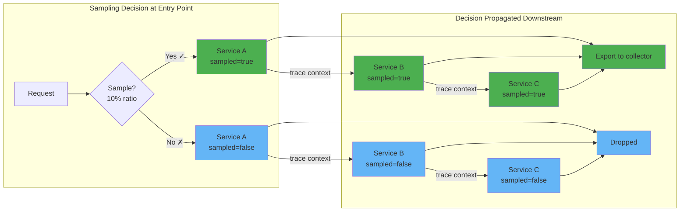
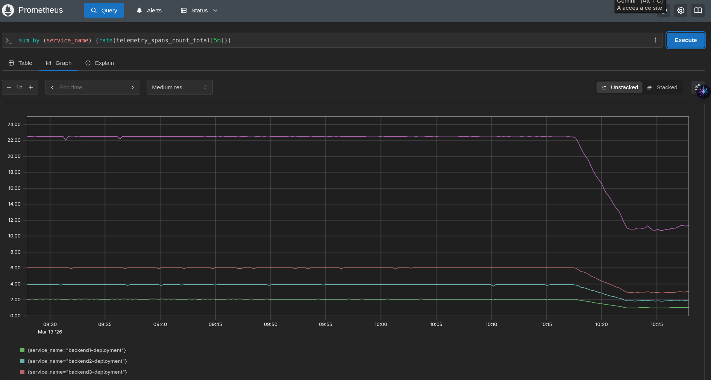

# Head based sampling

The sampling decision is made at the start of the trace (the "head") and propagated to all downstream services via trace context. The first service in the request chain decides whether to sample, and all downstream services honor that decision.

## How it works

1. A request arrives at the entry point service
2. The sampler makes a decision (e.g., 10% probability)
3. The decision is encoded in the `traceparent` header (`sampled` flag)
4. All downstream services read the flag and follow the decision
5. Sampled spans are exported; unsampled spans are dropped



## Head based sampling configuration

### Env variables

```bash
OTEL_TRACES_SAMPLER="parentbased_traceidratio" # or always_on, always_off, traceidratio, parentbased_always_on, parentbased_always_off, , parentbased_jaeger_remote, jaeger_remote
OTEL_TRACES_SAMPLER_ARG="0.2" # or for jaeger_remote|parentbased_jaeger_remote: KV of endpoint, pollingIntervalMs, initialSamplingRate
```

### SDK

```go
provider := trace.NewTracerProvider(
    trace.WithSampler(trace.AlwaysSample()),
)
```

### Declarative configuration

The [declarative configuration](https://opentelemetry.io/docs/languages/sdk-configuration/declarative-configuration/) (experimental) allows configuring samplers via YAML files:

```yaml
tracer_provider:
  sampler:
    parentbased:
      root:
        traceidratio:
          sampling_ratio: 0.25
      remote_parent_sampled:
        always_on:
      remote_parent_not_sampled:
        always_off:
```

Currently Java is the primary SDK with full declarative configuration support. Support in SDKs is documented in [language-support](https://github.com/open-telemetry/opentelemetry-configuration/blob/main/language-support-status.md).

### Instrumentation CR

```yaml
apiVersion: opentelemetry.io/v1alpha1
kind: Instrumentation
spec:
  sampler:
    type: parentbased_traceidratio
    argument: "1"
```

## Exercise: Change sampling rate to 50%

We are using the `Instrumentation` CR to manage the configuration for the SDKs in the cluster.
Therefore we need to configure the sampling rate in the `Instrumentation` CR: `spec.sampler.argument: 0.5`.

* Change the sampler argument to `0.5` in the [Instrumentation CR](./app/01-instrumentation.yaml)

## Jaeger remote sampling

Jaeger remote sampling allows SDKs to dynamically fetch sampling strategies from the OpenTelemetry Collector, enabling centralized per-service sampling configuration without redeploying applications.

How it works:
1. The collector serves sampling strategies via the [`jaegerremotesampling`](https://github.com/open-telemetry/opentelemetry-collector-contrib/tree/main/extension/jaegerremotesampling) extension
2. SDKs periodically poll the collector for their sampling configuration
3. When the configuration changes, SDKs pick up new rates without restart

Benefits:
- Centralized control - manage sampling rates for all services from one place
- Per-service and endpoint rates - critical services get higher sampling, noisy services get lower
- Dynamic updates - change rates without redeploying applications

### Exercise: Enable Jaeger remote sampling
Change the [Instrumentation CR](./app/01-instrumentation.yaml) and [collector](./app/03-collector-data-profiling.yaml).

How is it supported in the SDKs?
- backend1 (Python) - not supported
- backend2 (Java) - fully supported out of the box with the javaagent
- backend3 (Go) - [supported](https://github.com/open-telemetry/opentelemetry-go-contrib/tree/main/samplers/jaegerremote), but requires manual SDK configuration (not via env var with operator injection)
- frontend (Node.js) - not supported

## Head sampling in the collector

Head sampling can also be done in the collector using the [**probabilistic sampler processor**](https://github.com/open-telemetry/opentelemetry-collector-contrib/tree/main/processor/probabilisticsamplerprocessor). Unlike SDK sampling, the collector samples after spans are already created and exported by the application. It supports both **traces** and **logs**.

### Sampling modes

#### Hash Seed (default)

Uses the FNV hash function on the Trace ID (or a specified attribute for logs) and compares against the sampling percentage. Uses 14 bits of randomness.

```yaml
processors:
  probabilistic_sampler:
    mode: hash_seed
    sampling_percentage: 15
    hash_seed: 42  # must be the same across all collectors in the same tier
```

- **Traces**: hashes the Trace ID
- **Logs**: can hash any attribute (useful when logs don't have a Trace ID)
- Best for: simple percentage-based sampling, especially for logs

#### Proportional

Reduces items by a fixed ratio regardless of prior sampling decisions. Uses 56 bits of randomness per W3C spec.

```yaml
processors:
  probabilistic_sampler:
    mode: proportional
    sampling_percentage: 25
```

#### Equalizing

Same 56-bit randomness as proportional, but considers **existing sampling** from upstream. Ensures all items reach a minimum sampling probability. Items already sampled at a lower rate pass through; items sampled at a higher rate are further reduced.

```yaml
processors:
  probabilistic_sampler:
    mode: equalizing
    sampling_percentage: 10
```

- **Traces**: considers the upstream SDK sampling rate
- **Logs**: considers prior sampling decisions
- Best for: ensuring a uniform sampling rate across services with different SDK configurations

### Comparison

| Mode | Considers prior sampling? | Use case |
|------|--------------------------|----------|
| **hash_seed** | No | Simple sampling, logs without Trace ID |
| **proportional** | No | Reduce volume by a fixed ratio |
| **equalizing** | Yes | Normalize different upstream sampling rates |


### Exercise: Decrease traces and logs ingestion rate by 50%

```yaml
probabilistic_sampler:
    mode: equalizing
    sampling_percentage: 50
```



### When to use it

- You can't modify the application or SDK configuration (third-party services, legacy apps)
- You want centralized sampling control without touching each service's config
- As a safety net to enforce maximum ingestion rate even if SDKs are misconfigured
