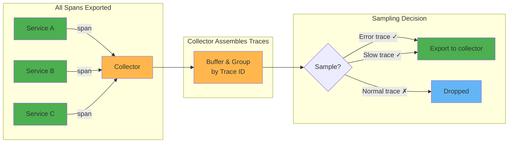

# Tail based sampling

The sampling decision is made at the end of the trace (the "tail") by a collector that assembles complete traces before deciding whether to keep or drop them based on their content (errors, latency, specific attributes).



## Tail sampling processor

The [tail sampling processor](https://github.com/open-telemetry/opentelemetry-collector-contrib/tree/main/processor/tailsamplingprocessor) buffers complete traces in memory and evaluates sampling policies to decide whether to keep or drop them.

### How it works

1. Spans arrive at the collector and are grouped by Trace ID
2. The collector waits `decision_wait` (default 30s) for all spans of a trace to arrive
3. Once the wait expires, policies are evaluated against the complete trace
4. The trace is either exported or dropped

### Core settings

```yaml
processors:
  tail_sampling:
    decision_wait: 10s              # wait time for trace completion
    num_traces: 50000               # max traces kept in memory
    expected_new_traces_per_sec: 100 # helps pre-allocate memory
    decision_cache:
      sampled_cache_size: 100000    # cache 'keep' decisions for late-arriving spans
      non_sampled_cache_size: 100000 # cache 'drop' decisions
```

### Available policies

| Policy | Description | Example use case |
|--------|-------------|-----------------|
| `always_sample` | Keep all traces | Default fallback |
| `probabilistic` | Sample a percentage | Keep 10% of normal traces |
| `status_code` | Match span status | Keep all error traces |
| `latency` | Match trace duration | Keep traces slower than 2s |
| `string_attribute` | Match string attributes | Keep traces from specific services |
| `numeric_attribute` | Match numeric attributes | Keep traces with high response codes |
| `span_count` | Match number of spans | Keep traces with many spans |
| `rate_limiting` | Limit spans per second | Cap output rate |
| `ottl_condition` | OTTL boolean expression | Complex custom conditions |
| `and` | Combine policies with AND | Error AND slow |
| `composite` | Multiple policies with rate allocation | Allocate sampling budget across policies |

### Configuration example

```yaml
processors:
  tail_sampling:
    decision_wait: 10s
    num_traces: 50000
    policies:
      # Always keep error traces
      - name: keep-errors
        type: status_code
        status_code:
          status_codes: [ERROR]

      # Always keep slow traces (>2s)
      - name: keep-slow
        type: latency
        latency:
          threshold_ms: 2000

      # Drop health check traces
      - name: drop-health
        type: drop
        drop:
          sub_policy:
            - name: health-match
              type: string_attribute
              string_attribute:
                key: http.route
                values: ["/health"]

      # Sample 10% of remaining traces
      - name: sample-rest
        type: probabilistic
        probabilistic:
          sampling_percentage: 10
```

### Policy evaluation

Policies are evaluated in order. The decision logic:
- If **any** policy decides to **sample** → trace is kept
- The `drop` policy explicitly drops matching traces before other policies can keep them
- `composite` policy allows allocating a sampling budget (e.g., 30% for errors, 20% for slow, 50% for the rest)

### Trade-offs

- **Memory**: all traces are buffered for `decision_wait` duration. High-traffic systems need significant memory.
- **Latency**: traces are delayed by `decision_wait` before reaching the backend
- **Single point**: all spans must go through the same collector instance (or use load balancing with trace ID affinity)
- **Late spans**: spans arriving after `decision_wait` may be dropped even if the trace was kept (use `decision_cache` to mitigate)
