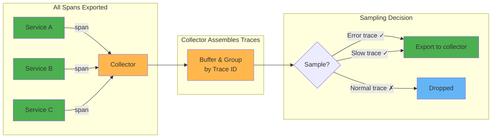
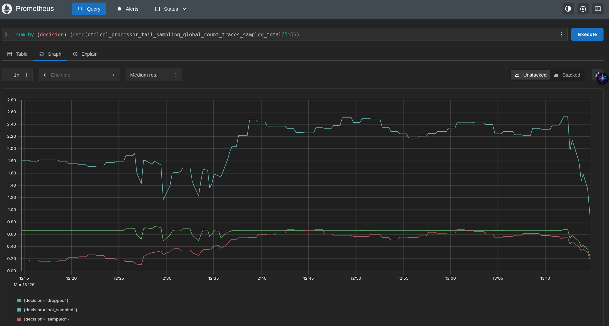
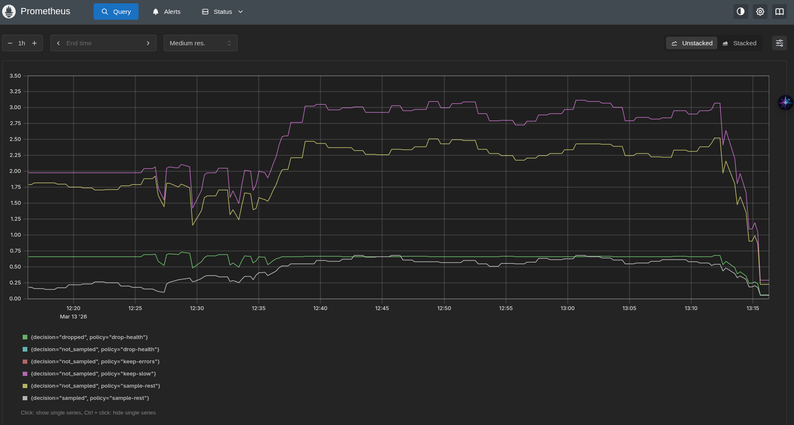

# Tail based sampling

The sampling decision is made at the end of the trace (the "tail") by a collector that assembles complete traces before deciding whether to keep or drop them based on their content (errors, latency, specific attributes).



## Tail sampling processor

The [tail sampling processor](https://github.com/open-telemetry/opentelemetry-collector-contrib/tree/main/processor/tailsamplingprocessor) buffers complete traces in memory and evaluates sampling policies to decide whether to keep or drop them.

### How it works

1. Spans arrive at the collector and are grouped by Trace ID
2. The collector waits `decision_wait` (default 30s) for all spans of a trace to arrive
3. Once the wait expires, policies are evaluated against the complete trace
4. The trace is either exported or dropped

### Core settings

```yaml
processors:
  tail_sampling:
    decision_wait: 10s              # wait time for trace completion
    num_traces: 50000               # max traces kept in memory
    expected_new_traces_per_sec: 100 # helps pre-allocate memory
    decision_cache:
      sampled_cache_size: 100000    # cache 'keep' decisions for late-arriving spans
      non_sampled_cache_size: 100000 # cache 'drop' decisions
```

### Available policies

| Policy | Description | Example use case |
|--------|-------------|-----------------|
| `always_sample` | Keep all traces | Default fallback |
| `probabilistic` | Sample a percentage | Keep 10% of normal traces |
| `status_code` | Match span status | Keep all error traces |
| `latency` | Match trace duration | Keep traces slower than 2s |
| `string_attribute` | Match string attributes | Keep traces from specific services |
| `numeric_attribute` | Match numeric attributes | Keep traces with high response codes |
| `span_count` | Match number of spans | Keep traces with many spans |
| `rate_limiting` | Limit spans per second | Cap output rate |
| `ottl_condition` | OTTL boolean expression | Complex custom conditions |
| `and` | Combine policies with AND | Error AND slow |
| `composite` | Multiple policies with rate allocation | Allocate sampling budget across policies |

### Configuration example

```yaml
processors:
  tail_sampling:
    decision_wait: 10s
    num_traces: 50000
    policies:
      # Always keep error traces
      - name: keep-errors
        type: status_code
        status_code:
          status_codes: [ERROR]

      # Always keep slow traces (>2s)
      - name: keep-slow
        type: latency
        latency:
          threshold_ms: 2000

      # Drop health check traces
      - name: drop-health
        type: drop
        drop:
          drop_sub_policy:
            - name: health-match
              type: string_attribute
              string_attribute:
                key: http.route
                values: ["/health"]

      # Sample 10% of remaining traces
      - name: sample-rest
        type: probabilistic
        probabilistic:
          sampling_percentage: 10
```

### Policy evaluation

Policies are evaluated in order. The decision logic:
- If any policy decides to sample → trace is kept
- The `drop` policy explicitly drops matching traces before other policies can keep them
- `composite` policy allows allocating a sampling budget (e.g., 30% for errors, 20% for slow, 50% for the rest)

### Trade-offs

- Memory: all traces are buffered for `decision_wait` duration. High-traffic systems need significant memory.
- Latency: traces are delayed by `decision_wait` before reaching the backend
- Single point: all spans must go through the same collector instance (or use load balancing with trace ID affinity)
- Late spans: spans arriving after `decision_wait` may be dropped even if the trace was kept (use `decision_cache` to mitigate)

## Exercise: use tail sampling in the demo app

Requirements:
* Drop /health traces
* Keep error traces
* Keep slow traces (>2s)
* Sample 20% of remaining traces

```bash
kubectl apply -f https://raw.githubusercontent.com/pavolloffay/kubecon-eu-2026-opentelemetry-observability-on-budget/refs/heads/main/app/01-instrumentation.yaml
kubectl apply -f https://raw.githubusercontent.com/pavolloffay/kubecon-eu-2026-opentelemetry-observability-on-budget/refs/heads/main/app/04-collector-tail-sampling.yaml
make restart
```





### Monitor tail sampling

The tail sampling processor exposes [internal metrics](https://github.com/open-telemetry/opentelemetry-collector-contrib/blob/main/processor/tailsamplingprocessor/documentation.md) to monitor its behavior:

Sampling decisions:
- [Global: sampled vs dropped vs not_sampled](http://localhost:9090/graph?g0.expr=sum%20by%20(decision)%20(rate(otelcol_processor_tail_sampling_global_count_traces_sampled_total[5m]))&g0.tab=0&g0.range_input=1h)
- [Per policy: traces sampled/dropped](http://localhost:9090/graph?g0.expr=sum%20by%20(policy,%20decision)%20(rate(otelcol_processor_tail_sampling_count_traces_sampled_total[5m]))&g0.tab=0&g0.range_input=1h)

Health & capacity:
- [Traces in memory + new traces/sec](http://localhost:9090/graph?g0.expr=otelcol_processor_tail_sampling_sampling_traces_on_memory&g0.tab=0&g0.range_input=1h&g1.expr=rate(otelcol_processor_tail_sampling_new_trace_id_received_total[5m])&g1.tab=0&g1.range_input=1h)
- [Traces dropped too early + policy errors](http://localhost:9090/graph?g0.expr=rate(otelcol_processor_tail_sampling_sampling_trace_dropped_too_early_total[5m])&g0.tab=0&g0.range_input=1h&g1.expr=rate(otelcol_processor_tail_sampling_sampling_policy_evaluation_error_total[5m])&g1.tab=0&g1.range_input=1h)

Policy performance:
- [Policy execution count per policy](http://localhost:9090/graph?g0.expr=sum%20by%20(policy)%20(rate(otelcol_processor_tail_sampling_sampling_policy_execution_count_total[5m]))&g0.tab=0&g0.range_input=1h)
- [Policy execution time per policy](http://localhost:9090/graph?g0.expr=sum%20by%20(policy)%20(rate(otelcol_processor_tail_sampling_sampling_policy_execution_time_sum__s_total[5m]))&g0.tab=0&g0.range_input=1h)

Collector memory usage:
* [Collector memory usage](http://localhost:9090/graph?g0.expr=otelcol_process_memory_rss_bytes&g0.tab=0&g0.range_input=1h&g1.expr=otelcol_process_runtime_heap_alloc_bytes&g1.tab=0&g1.range_input=1h)
* `otelcol_processor_tail_sampling_sampling_trace_dropped_too_early` - count of traces that needed to be dropped before the configured wait time (`decision_wait`).

### Sizing the collector memory for tail sampling

The tail sampling processor buffers all traces in memory for `decision_wait` duration. Memory usage depends on:

```
traces_in_memory = incoming_traces_per_sec × decision_wait_seconds
memory_needed = traces_in_memory × avg_spans_per_trace × avg_span_size_bytes
```

#### Estimate memory before deploying tail sampling

Before enabling tail sampling, you can estimate the required memory using metrics from the collector that is already running without tail sampling.

Step 1: Measure incoming span rate

```promql
sum(rate(otelcol_receiver_accepted_spans_total[5m]))
```

This tells you how many spans/sec the collector receives. Each of these will be buffered in memory during `decision_wait`.

Step 2: Measure current collector memory

```promql
otelcol_process_memory_rss_bytes
```

This is the baseline memory without tail sampling. Tail sampling will add on top of this.

Step 3: Calculate expected memory

```
spans_in_memory     = incoming_spans_per_sec × decision_wait_seconds
avg_span_size       = measure with file exporter (see below)
buffer_memory       = spans_in_memory × avg_span_size
total_memory        = baseline_memory + buffer_memory × 2 (Go runtime overhead)
```

Example for our demo app (loadgen ~50 req/sec, ~15 spans per trace across 4 services):
```
Incoming spans:     ~750 spans/sec (from otelcol_receiver_accepted_spans_total)
decision_wait:      10s
Spans in memory:    750 × 10 = 7,500 spans
Buffer memory:      7,500 × 2 KB = 15 MB
Baseline memory:    ~215 MB (from otelcol_process_memory_rss_bytes)
Total estimate:     215 MB + 15 MB × 2 ≈ 245 MB
K8s memory limit:   ~370 MB (1.5x total for safety)
```

For a production system with higher traffic:
```
Incoming spans:     10,000 spans/sec
decision_wait:      30s
Spans in memory:    10,000 × 30 = 300,000 spans
Buffer memory:      300,000 × 2 KB = 600 MB
Baseline memory:    100 MB
Total estimate:     100 MB + 600 MB × 2 = 1.3 GB
K8s memory limit:   ~2 GB (1.5x total for safety)
```

**Step 4: Set `num_traces`**

```
num_traces = incoming_traces_per_sec × decision_wait_seconds × 1.5 (safety margin)
```

If `num_traces` is too low, traces are evicted before `decision_wait` expires and `otelcol_processor_tail_sampling_sampling_trace_dropped_too_early` increases.

#### Measure average span size

There is no collector metric that exposes span size in bytes. To measure it, temporarily add a `file` exporter with protobuf format to your collector:

```yaml
exporters:
  file/sizing:
    path: /tmp/spans.pb
    format: proto

service:
  pipelines:
    traces:
      exporters: [..., file/sizing]
```

After collecting data for a few minutes, calculate:

```
avg_span_size = file_size_bytes / number_of_spans
```

Where `number_of_spans` comes from `otelcol_exporter_sent_spans_total{exporter="file/sizing"}`.

Remove the file exporter after measuring.

#### After deployment: verify with tail sampling metrics

Once tail sampling is running, verify your estimates with:

- `otelcol_processor_tail_sampling_sampling_traces_on_memory` — actual traces buffered
- `otelcol_process_memory_rss_bytes` — actual memory used
- `otelcol_processor_tail_sampling_sampling_trace_dropped_too_early` — 0 means `num_traces` is sufficient
- `otelcol_process_runtime_heap_alloc_bytes / otelcol_processor_tail_sampling_sampling_traces_on_memory` — actual memory per trace

#### Configuration knobs

| Setting | Effect on memory |
|---------|-----------------|
| `decision_wait` | Lower = less memory, but risk missing late spans |
| `num_traces` | Hard cap on buffered traces. When exceeded, oldest traces are dropped (`sampling_trace_dropped_too_early`) |
| `expected_new_traces_per_sec` | Pre-allocates memory, reduces GC pressure |
| `decision_cache.sampled_cache_size` | Lightweight cache for late spans after trace eviction |
